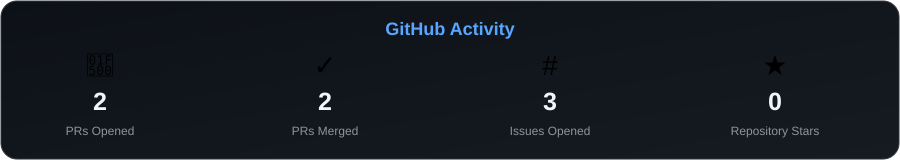

<h1 align="center">Hi 👋, I'm Arnesh Bera</h1>

  

  
  

  
  

---

## 👨‍💻 About Me

I'm a **Computer Science undergraduate** focused on building practical systems with **Machine Learning, Generative AI, backend technologies, and strong problem-solving fundamentals**.

I enjoy taking ideas from **data → algorithms → models → APIs → working applications**, while continuously strengthening my foundation in **Data Structures & Algorithms**.

- 🧠 Exploring **Machine Learning & Generative AI**
- 🤖 Building **RAG systems and AI-powered applications**
- ⚡ Developing backend systems with **Python & FastAPI**
- 🗄️ Working with **SQL and NoSQL databases**
- 🛣️ Building real-world **Computer Vision applications**
- 🧩 Maintaining a strong focus on **Data Structures & Algorithms**
- 🌱 Contributing to **Open Source**
- 🚀 Participating in **hackathons and technical challenges**

---

## 🧩 Data Structures & Algorithms

  
  
  

I place a strong emphasis on **Data Structures & Algorithms** as the foundation of my software engineering journey.

I regularly practice **algorithmic problem solving**, focusing on writing efficient, optimized, and maintainable solutions while developing a deeper understanding of computational complexity and problem-solving patterns.

> **Strong fundamentals → Better problem solving → Better engineering.**

---

## 🧰 Tech Stack

### 👨‍💻 Languages

  

### 🧠 Machine Learning & Data Science

  
  
  
  
  

### 🤖 GenAI & RAG

  
  
  
  

### ⚡ Backend & Databases

  

### 🛠️ Tools & Platforms

  
  

---

## 📊 GitHub Activity

  

  <i>Automatically updated through GitHub Actions.</i>

---

## 🚀 Featured Projects

<table>
<tr>
<td width="50%">

### 🛣️ PaveXa

**AI-powered road damage detection and maintenance system.**

- YOLO-based Computer Vision
- RDD2022 dataset
- FastAPI backend
- PostgreSQL
- OpenStreetMap + Overpass API
- Municipal monitoring dashboard

</td>

<td width="50%">

### 🛡️ FineX

**AI-powered fraud detection and risk decision system.**

- LightGBM
- Fraud probability prediction
- Risk classification
- Automated decision engine
- FastAPI backend
- Streamlit interface

</td>
</tr>

<tr>
<td width="50%">

### 📄 HirenixCV

**AI-powered resume analysis and optimization engine.**

- ATS Resume Analysis
- Job Description Matching
- Resume Optimization
- Resume Q&A
- FastAPI backend
- RAG / LLM integration

</td>

<td width="50%">

### 🏥 MedAssist-AI

**Retrieval-Augmented Generation chatbot for medical documents.**

- LangChain
- Pinecone
- HuggingFace embeddings
- Groq LLM
- PDF document processing
- Semantic retrieval

</td>
</tr>

<tr>
<td width="50%">

### 📦 InvoiceLens

**Machine Learning system for freight cost prediction.**

- Feature engineering
- Regression modelling
- Model evaluation
- SQLite
- Streamlit deployment
- R²: 97.06%

</td>

<td width="50%">

### 🌱 Open Source

**Building and contributing to real-world open-source projects.**

- Pull requests
- Code reviews
- Issue-driven development
- Collaborative Git workflows
- Continuous learning

</td>
</tr>
</table>

---

## 📈 GitHub Analytics

  
  

  

---

## 🌐 Open Source & Contributions

  

  <i>Building, contributing, learning, and shipping — one commit at a time.</i>

---

## 🏆 Achievements

- 🥇 **National Semi-Finalist — Flipkart GRID 8.0**
- 🚀 Participated in multiple **AI/ML & hackathon challenges**
- 🌱 Started contributing to **Open Source**
- ☁️ Exploring **AWS & Cloud technologies**
- 🤖 Building practical **AI/ML systems**
- 🧩 Continuously strengthening **DSA and algorithmic problem solving**

---

## 🌐 Let's Connect

  
  

---

  

  <i>"Build. Break. Learn. Improve. Repeat."</i>

